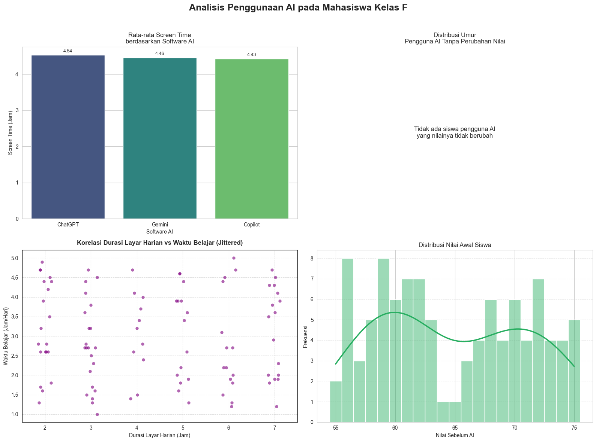
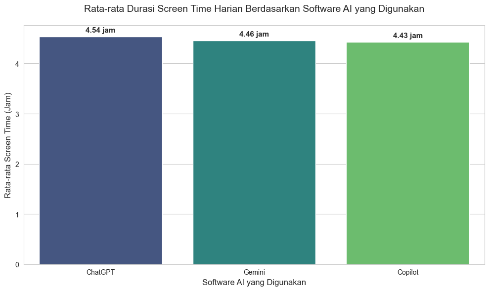
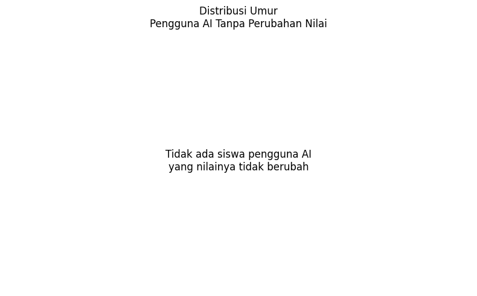
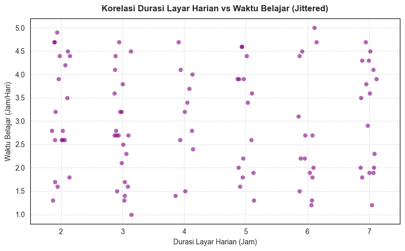
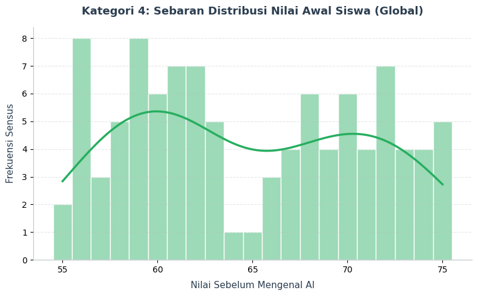

<div align="center">

# 📊 Student AI Usage Visualization

### Analisis dan Visualisasi Data Penggunaan AI pada Pelajar

<a href="https://www.python.org/"></a>
<a href="https://jupyter.org/"></a>
<a href="https://pandas.pydata.org/"></a>
<a href="https://matplotlib.org/"></a>
<a href="https://seaborn.pydata.org/"></a>

<br><br>

🎓 Post-Test Praktikum Algoritma dan Pemrograman · Semester 2 · Teknik Elektro · Universitas Diponegoro

👥 Kelompok 6 · Kelas F

</div>

---

## 🖼️ Preview

<p align="center">
  
</p>

---

## 📌 About The Project

**Student AI Usage Visualization** adalah project eksplorasi data yang bertujuan untuk melihat pola penggunaan AI dalam aktivitas belajar. Dataset yang digunakan adalah `Kelas F_Student AI Usage.csv`, kemudian dianalisis dan divisualisasikan menggunakan beberapa notebook Jupyter.

Project ini membahas beberapa hal utama, seperti:

- Rata-rata durasi screen time harian berdasarkan software AI yang digunakan;
- Distribusi umur pengguna AI yang tidak mengalami perubahan nilai;
- Korelasi antara durasi layar harian dan waktu belajar menggunakan jittered stripplot;
- Distribusi nilai awal siswa sebelum menggunakan AI;
- Rangkuman seluruh grafik dalam satu visualisasi gabungan.

---

## ✨ Features

- 📁 Membaca dataset CSV menggunakan `pandas`
- 📊 Membuat bar chart, stripplot, dan histogram
- 🧠 Menganalisis pola penggunaan AI berdasarkan tools yang digunakan
- 🎓 Membandingkan data berdasarkan perubahan nilai sebelum dan sesudah AI
- 🖥️ Menganalisis korelasi durasi layar harian dengan jam belajar
- 🧩 Menggabungkan semua grafik ke dalam layout 2 × 2

---

## 🛠️ Built With

Project ini dibuat menggunakan:

| Tools | Fungsi |
| --- | --- |
| **Python 3.12** | Bahasa pemrograman utama |
| **Jupyter Notebook** | Menjalankan analisis dan visualisasi |
| **pandas** | Membaca dan mengolah dataset |
| **matplotlib** | Membuat visualisasi dasar |
| **seaborn** | Membuat visualisasi statistik yang lebih rapi |
| **numpy** | Komputasi numerik dan pengaturan seed acak |

---

## 📂 Project Structure

```bash
.
├── assets/
│   ├── grafik-kategori-a.png
│   ├── grafik-kategori-b.png
│   ├── grafik-kategori-c.png
│   ├── grafik-kategori-d.png
│   └── grafik-gabungan.png
├── Grafik Kategori A.ipynb
├── Grafik Kategori B.ipynb
├── Grafik Kategori C.ipynb
├── Grafik Kategori D.ipynb
├── Grafik Kategori Gabungan.ipynb
├── Kelas F_Student AI Usage.csv
└── README.md
```

---

## 📊 Dataset Overview

Dataset terdiri dari **100 responden** dengan **9 kolom utama**.

| Kolom | Deskripsi |
| --- | --- |
| `age` | Usia responden |
| `education_level` | Tingkat pendidikan, yaitu `school` atau `college` |
| `study_hours_per_day` | Rata-rata jam belajar per hari |
| `uses_ai` | Status penggunaan AI, yaitu `Yes` atau `No` |
| `ai_tools_used` | Tools AI yang digunakan, seperti ChatGPT, Gemini, Copilot, atau kosong |
| `purpose_of_ai` | Tujuan penggunaan AI, seperti Research, Homework, Coding, atau kosong |
| `grades_before_ai` | Nilai sebelum penggunaan AI |
| `grades_after_ai` | Nilai setelah penggunaan AI |
| `daily_screen_time_hours` | Durasi screen time harian dalam jam |

---

## 📈 Visualization List

| Notebook | Visualisasi | Deskripsi |
| --- | --- | --- |
| `Grafik 1 (Kategori A).ipynb` | Bar Chart | Rata-rata screen time harian berdasarkan software AI yang digunakan |
| `Grafik 2 (Kategori B).ipynb` | Bar Chart | Distribusi umur pengguna AI yang tidak mengalami perubahan nilai |
| `Grafik 3 (Kategori C).ipynb` | Stripplot (Jittered) | Korelasi durasi layar harian dengan waktu belajar per hari |
| `Grafik 4 (Kategori D).ipynb` | Histogram + KDE | Distribusi nilai awal siswa sebelum penggunaan AI |
| `Grafik 5 (Gabungan).ipynb` | Combined Plot | Gabungan seluruh visualisasi dalam layout 2 × 2 |

---

## 🔍 Chart Preview

<details>
<summary><b>Grafik 1 — Rata-rata Screen Time berdasarkan Software AI</b></summary>

<br>

<p align="center">
  
</p>

</details>

<details>
<summary><b>Grafik 2 — Distribusi Umur Pengguna AI Tanpa Perubahan Nilai</b></summary>

<br>

<p align="center">
  
</p>

</details>

<details>
<summary><b>Grafik 3 — Korelasi Durasi Layar Harian vs Waktu Belajar (Jittered)</b></summary>

<br>

<p align="center">
  
</p>

</details>

<details>
<summary><b>Grafik 4 — Distribusi Nilai Awal Siswa</b></summary>

<br>

<p align="center">
  
</p>

</details>

---

## 🧠 Key Insights

Beberapa insight dari dataset:

- Total data yang dianalisis adalah **100 responden**.
- Terdapat **52 responden school** dan **48 responden college**.
- Sebanyak **40 responden menggunakan AI**, sedangkan **60 responden tidak menggunakan AI**.
- Rata-rata jam belajar per hari adalah sekitar **2,99 jam**.
- Dari seluruh pengguna AI, **tidak ada** yang nilainya tidak berubah sama sekali setelah menggunakan AI.
- Grafik stripplot menunjukkan sebaran korelasi antara durasi layar harian dan waktu belajar yang bervariasi.
- Distribusi nilai awal siswa divisualisasikan dengan histogram dan kurva KDE untuk melihat pola sebaran nilai.

---

## 🚀 Getting Started

Ikuti langkah berikut untuk menjalankan project secara lokal.

### 1. Clone Repository

```bash
git clone https://github.com/username/student-ai-usage-visualization.git
cd student-ai-usage-visualization
```

> Ganti `username` dan `student-ai-usage-visualization` sesuai nama akun dan repository GitHub kamu.

### 2. Buat Virtual Environment

```bash
python -m venv .venv
```

Aktifkan virtual environment:

```bash
# Windows
.venv\Scripts\activate

# macOS/Linux
source .venv/bin/activate
```

### 3. Install Dependencies

```bash
pip install pandas matplotlib seaborn numpy notebook
```

Atau buat file `requirements.txt`:

```txt
pandas
matplotlib
seaborn
numpy
notebook
```

Lalu jalankan:

```bash
pip install -r requirements.txt
```

### 4. Jalankan Notebook

```bash
jupyter notebook
```

Setelah Jupyter terbuka, pilih notebook yang ingin dijalankan.

---

## ▶️ Usage

Untuk melihat seluruh hasil visualisasi dalam satu tampilan, jalankan notebook:

```bash
Grafik Kategori Gabungan.ipynb
```

Pastikan file dataset berikut berada di folder yang sama dengan notebook:

```bash
Kelas F_Student AI Usage.csv
```

Contoh kode utama:

```python
import pandas as pd
import matplotlib.pyplot as plt
import seaborn as sns
import numpy as np

# Load dataset
df = pd.read_csv("Kelas F_Student AI Usage.csv")

# Menghitung peningkatan nilai
df["Grade_Improvement"] = df["grades_after_ai"] - df["grades_before_ai"]
```

---

## 💡 Future Improvement

Beberapa pengembangan yang bisa ditambahkan:

- membuat dashboard interaktif menggunakan Streamlit;
- menambahkan analisis korelasi antarvariabel secara statistik;
- menyimpan grafik otomatis ke folder `assets`;
- menambahkan file `requirements.txt`;
- membuat visualisasi tambahan berdasarkan tujuan penggunaan AI (`purpose_of_ai`);
- menambahkan kesimpulan akhir berbasis analisis statistik.

---

## 👥 Our Team

Kelompok 6 · Kelas F · Teknik Elektro · Universitas Diponegoro

| No | Nama | NIM | Tugas |
| --- | --- | --- | --- |
| 1 | Salwa Andini Tanjung | 21060125120004 | Pembuatan Program dan Visual Grafik Kategori A, Kategori B, dan Grafik Gabungan |
| 2 | Zulfatus Soraya | 21060125120015 | Mendesain Infografis untuk Publikasi Instagram Story secara Penuh |
| 3 | Rachmat Bagus Priyono | 21060125120019 | Mendesain Infografis untuk Publikasi LinkedIn secara Penuh |
| 4 | Maulidia Putri | 21060125120034 | Pembuatan Program dan Visual Grafik Kategori C dan Kategori D |

---

## 📄 License

Project ini dapat digunakan untuk keperluan pembelajaran, eksplorasi data, dan pengembangan portofolio.

<div align="center">

⭐ Jangan lupa beri star pada repository ini jika project ini bermanfaat.

</div>
